Lakeflow Spark Declarative Pipelines es un marco dentro de la plataforma
Databricks Lakehouse para construir y ejecutar pipelines de datos de
manera declarativa. Esto significa que especificas qué transformaciones
de datos quieres lograr y el sistema automáticamente determina cómo
ejecutarlas de forma eficiente, gestionando muchas de las complejidades
de la ingeniería de datos tradicional.

Lakeflow Spark Declarative Pipelines simplifica el desarrollo de
pipelines ETL (Extract, Transform, Load) al abstraer los detalles
complejos y de bajo nivel. En lugar de escribir código procedimental que
dicte cada paso, usas una sintaxis declarativa más simple en SQL o
Python.

**Nota:** La interfaz de usuario de Azure Databricks
está sujeta a mejoras continuas. La interfaz de usuario puede haber
cambiado. Lakeflow Spark Declarative Pipelines es la evolución de las
Delta Live Tables (DLT) de Databricks, que ofrecen un enfoque unificado
tanto para cargas de trabajo por lotes como para streaming.

Provisión del espacio de trabajo de Azure Databricks

1.  Inicia sesión en el **portal de Azure** en https://portal.azure.com.

2.  En el portal, seleccionar Crear recurso y seleccionar Dtabricks

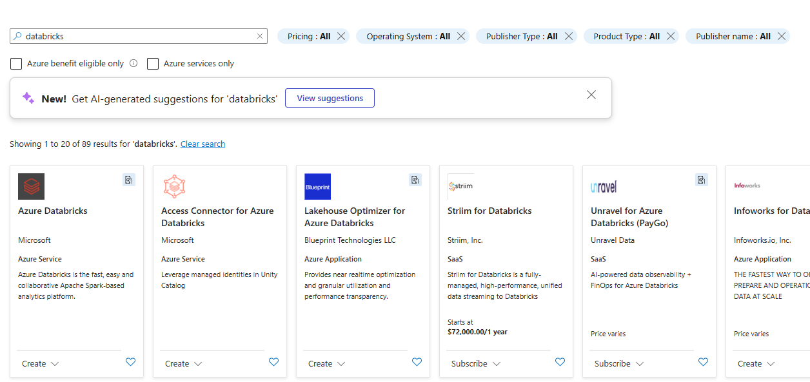

> 3.- Seleccionar **Create**
>
> 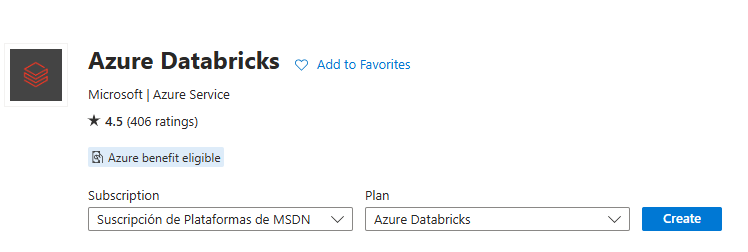 style="width:6.1375in;height:2.06736in" />

4.- Llenar los datos para crear el grupo de recursos de Azure Databricks
con los datos propios.

**Para esta actividad y la siguiente se requiere capa Premium**

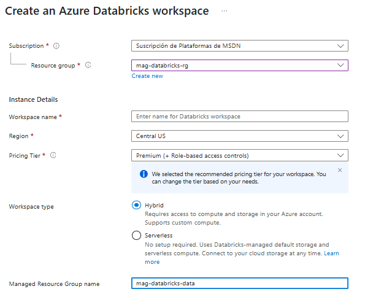

5.- Esperar cerca de 10 minutos a que termine de crearse.

Crear un clúster

1.  En el portal de Azure, navega por el grupo de recursos que contiene
    tu espacio de trabajo existente en Azure Databricks y selecciona tu
    recurso de Servicio Azure Databricks.

2.  En la página de Resumen de tu espacio de trabajo, utiliza el botón
    **Launch Workspace** para abrir tu espacio de trabajo Azure
    Databricks en una nueva pestaña del navegador; inicia sesión si se
    lo solicita.

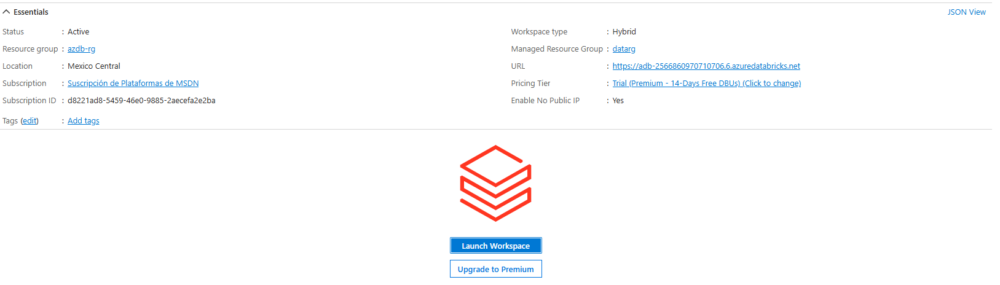

Al utilizar el portal Databricks Workspace, pueden mostrarse diversos
consejos y notificaciones. Cerrar estos y sigue las instrucciones
proporcionadas para completar las tareas de este ejercicio.

1.  En la barra lateral de la izquierda, selecciona **(+)** New y luego
    selecciona **Clúster** (puede que tengas que buscar en el submenú
    **More**)

2.  

3.  En la página de **New Cluster**, crea un nuevo clúster con los
    siguientes ajustes:

    -   **Computer Name**: *Clúster de nombre de usuario* (el nombre
        predeterminado del clúster)

    -   **Policy**: Sin restricciones

    -   **Modo de clúster**: Single node.

    -   **Access mode**: Dedicated (formely: Single user) (*con tu
        cuenta de usuario seleccionada*)

    -   **Databricks runtime**: 17.3 LTS (Spark 4.0, Scala 2.13) o
        posterior

    -   **Photon acceleration**: seleccionado

    -   **Tipo de nodo**: Standard\_D4ds\_v5

    -   **Terminate after** *20* **minutes of inactivity**

    -   Seleccionar **Create**

4.  Espera a que se cree el clúster. Puede que tarde 5 minutos.

Crea un cuaderno para consumir datos

1.  En la barra lateral, usa el **enlace (+) New** para crear un
    **Notebook**.

2.  Cambia el nombre predeterminado del cuaderno a **Ingestión y
    exploración de datos** y, en la lista desplegable **Conectar,**
    selecciona **Serverless** **Starter Warehouse** si aún no está
    seleccionado. Si el cómputo no se está ejecutando, puede tardar un
    minuto aproximadamente en iniciarse.

3.  En la primera celda del cuaderno, introduce el siguiente código, que
    crea un volumen para almacenar datos sobre covid.

> **%sql**
>
> **CREATE VOLUME IF NOT EXISTS covid\_data\_volume**

1.  Usa la opción de menú **▸ Ejecutar celda** a la izquierda de la
    celda para ejecutarlo. Luego espera a que el trabajo de Spark
    ejecutado por el código se complete.

> 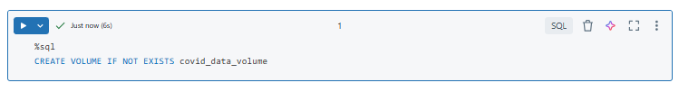 style="width:4.82156in;height:0.6563in" />
>
> Revisa el Catalog Explorer, en tu organización. Debe aparecer el
> volumen. Regresa al notebook.
>
> 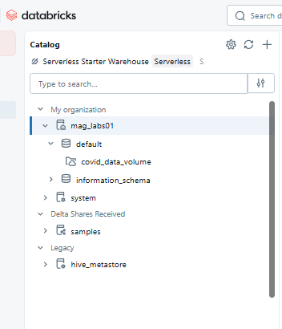 style="width:2.82115in;height:3.286in" />

1.  Conéctate al clúster creado y crea una segunda celda (Python) en el
    cuaderno e introduce el siguiente código.

> **import requests**
>
> **\# Descargar el archive CSV**
>
> **url =
> "https://github.com/MicrosoftLearning/mslearn-databricks/raw/main/data/covid\_data.csv"**
>
> **response = requests.get(url)**
>
> **response.raise\_for\_status()**
>
> **\# Obtener el catálogo actual**
>
> **catalog\_name = spark.sql("SELECT
> current\_catalog()").collect()\[0\]\[0\]**
>
> **\# Escribir directamente al catálogo Unity**
>
> **volume\_path =
> f"/Volumes/{catalog\_name}/default/covid\_data\_volume/covid\_data.csv"**
>
> **with open(volume\_path, "wb") as f:**
>
> **f.write(response.content)**

Este código descarga un archivo CSV que contiene datos de COVID-19 desde
una URL de GitHub y lo guarda en un volumen de Unity Catalog en
Databricks usando el contexto actual del catálogo.

1.  Usa la opción de menú **▸ Run cell** a la izquierda de la celda para
    ejecutarlo. Luego espera a que el trabajo de Spark ejecutado por el
    código se complete. Nuevamente revisa tu catálogo y ahora selecciona
    el volumen. Debe aparecer el archivo csv.

> 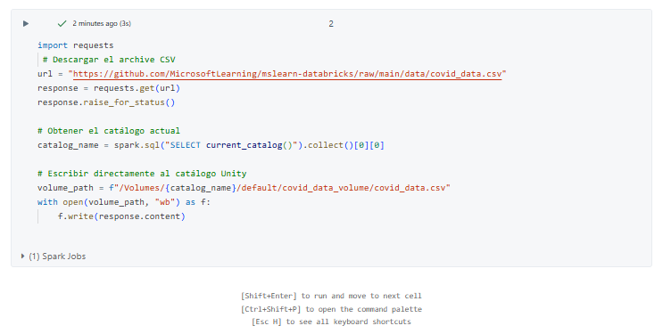 style="width:5.14568in;height:2.56585in" />
>
> 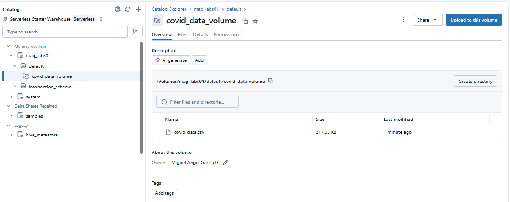 style="width:6.1375in;height:2.43819in" />

Crear Lakeflow Declarative Pipeline usando SQL

1.  Selecciona **Jobs y& Pipelines** en la barra lateral izquierda y
    luego selecciona **Pipeline ETL**.

> 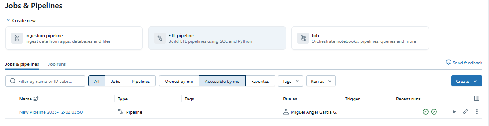 style="width:5.87485in;height:1.51624in" />

1.  Selecciona **Start with an empty file.**.

2.  En el diálogo, selecciona **SQL** como lenguaje para el primer
    archivo. No tienes que actualizar la ruta de la carpeta. Adelante,
    selecciona el **botón Select**.

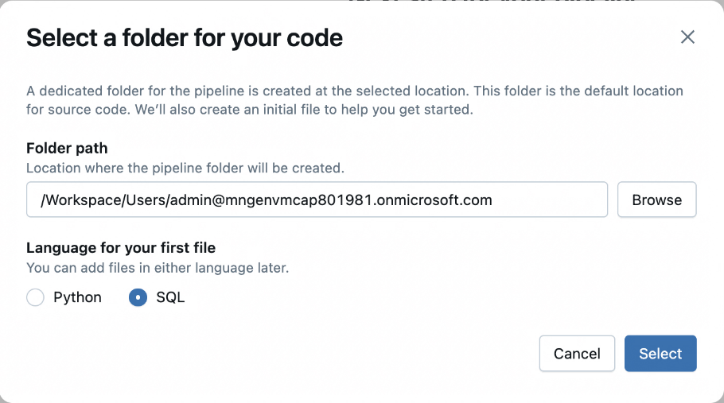

1.  Renombrar el pipeline a **Covid-Pipeline**.

2.  Introduce el siguiente código en el editor. Asegúrate de cambiar el
    nombre del catálogo por el nombre de tu catálogo.

**CREATE OR REFRESH STREAMING TABLE covid\_bronze**

**COMMENT "Nuevos datos de covid serán consumidos incrementalmente desde
la nube";**

**CREATE FLOW covid\_bronze\_ingest\_flow AS**

**INSERT INTO covid\_bronze BY NAME**

**SELECT**

**Last\_Update,**

**Country\_Region,**

**Confirmed,**

**Deaths,**

**Recovered**

**FROM STREAM read\_files(**

**-- Reemplazar con el nombre del catálogo propio en uso:**

**"/Volumes/&lt;catalog name&gt;/default/covid\_data\_volume/",**

**format =&gt; "csv",**

**header =&gt; true**

**);**

Este código establece un pipeline de ingesta en streaming en Databricks
que lee continuamente nuevos archivos CSV que contienen datos de
COVID-19 de un volumen del Catálogo Unity e inserta columnas
seleccionadas en una tabla de streaming llamada covid\_bronze,
permitiendo el procesamiento y análisis incremental de datos.

1.  Selecciona el botón **Run file** y observa la salida. Si aparece un
    error, asegúrate de tener el nombre correcto del catálogo definido.

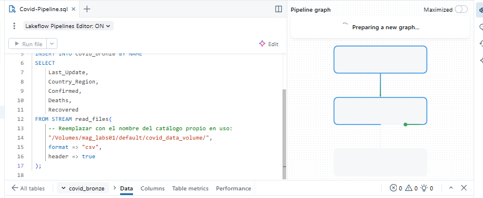

1.  En el mismo editor, introduce el siguiente código (debajo del código
    anterior).

> **CREATE OR REFRESH MATERIALIZED VIEW covid\_silver(**
>
> **CONSTRAINT valid\_country\_region EXPECT (Country\_Region IS NOT
> NULL) ON VIOLATION FAIL UPDATE**
>
> **)**
>
> **COMMENT "Datos filtrados y formateados para análisis."**
>
> **AS**
>
> **SELECT**
>
> **TO\_DATE(Last\_Update, 'MM/dd/yyyy') as Report\_Date,**
>
> **Country\_Region,**
>
> **Confirmed,**
>
> **Deaths,**
>
> **Recovered**
>
> **FROM covid\_bronze;**

Este código crea o actualiza una **vista materializada** llamada
covid\_silver que transforma y filtra los datos de la tabla de streaming
covid\_bronze mediante:

-   ✅ Convertir la cadena de Last\_Update en una Report\_Date adecuada
    usando el formato MM/dd/yyyy.

-   ✅ Seleccionando columnas clave (Country\_Region, Confirmado,
    Fallecimientos, Recuperados) para análisis posteriores.

-   ✅ Hacer cumplir una restricción de calidad de datos para asegurar
    que Country\_Region no sea nulo—si se viola durante las
    actualizaciones, la operación falla.

-   📝 Añadir un comentario para describir el propósito de la vista:
    datos de COVID-19 formateados y filtrados para su análisis.

Esta configuración ayuda a garantizar que haya datos limpios y
estructurados disponibles para análisis o reportes.

1.  Selecciona el botón **Run File** y observa la salida.

2.  En el mismo editor, introduce el siguiente código (debajo del código
    anterior).

> **CREATE OR REFRESH MATERIALIZED VIEW covid\_gold**
>
> **COMMENT "Agregaciones diarias para consumo."**
>
> **AS**
>
> **SELECT**
>
> **Report\_Date,**
>
> **sum(Confirmed) as Total\_Confirmed,**
>
> **sum(Deaths) as Total\_Deaths,**
>
> **sum(Recovered) as Total\_Recovered**
>
> **FROM covid\_silver**
>
> **WHERE Country\_Region = 'US'**
>
> **GROUP BY Report\_Date;**

Este código SQL crea o actualiza una vista materializada llamada
covid\_gold que proporciona estadísticas agregadas diarias de COVID-19
para EE. UU. mediante:

-   🗓 Agrupación de datos por Report\_Date

-   📊 Resumen de los recuentos de casos confirmados, defunciones y
    recuperados en todas las regiones de EE. UU. para cada día

-   💬 Añadir un comentario para describir su propósito: un resumen
    general de los totales diarios para análisis o informes

Esta vista covid\_gold representa la **"capa de oro"** en una
arquitectura medallón—optimizada para su consumo mediante paneles,
informes o modelos de ciencia de datos.

1.  Presionar el botón **Run file** y observa la salida.

2.  Vuelve al Explorador de Catálogos. Abre tu catálogo, el esquema por
    defecto y examina las diferentes tablas y volúmenes creados.

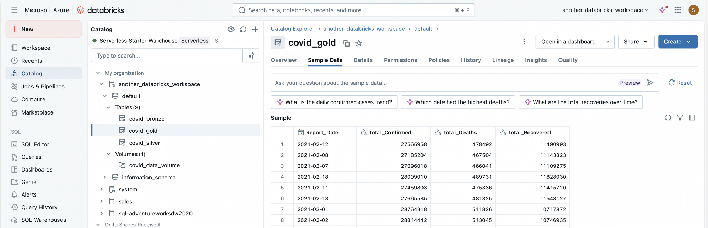

Ver los resultados como una visualización

Después de crear las tablas, es posible cargarlas en dataframes y
visualizar los datos.

1.  En el cuaderno *de Ingestión y Exploración de Datos*, añade una
    nueva celda de código y ejecuta el siguiente código para cargar el
    covid\_gold en un dataframe:

**%sql**

**SELECT \* FROM covid\_gold**

1.  Sobre de la tabla de resultados, selecciona **+** y luego selecciona
    **Visualizations** para ver el editor de visualización, y después
    aplica las siguientes opciones:

    -   **Tipo de visualización**: Línea

    -   **Columna X**: Report\_Date

    -   **Columna Y**: *Añade una nueva columna y selecciona*
        **Total\_Confirmed**. *Aplica la* agregación *de Sum*.

2.  Guarda la visualización y ve la tabla resultante en el cuaderno.
