Azure Databricks facilita el análisis exploratorio de datos (EDA),
permitiendo a los usuarios descubrir rápidamente insights y guiar la
toma de decisiones. Se integra con una variedad de herramientas y
técnicas para EDA, incluyendo métodos estadísticos y visualizaciones,
para resumir las características de los datos e identificar cualquier
problema subyacente.

Conectar al workspace creado previamente

1.  Iniciar sesión en Azure.

2.  Entrar al servicio de Azure Databricks creado previamente

3.  Seleccionar **Launch Workspace**

Crear un notebook

1.  En la barra lateral, usa el enlace **New** **(+)**para crear un
    **Notebook**.

2.  Cambia el nombre predeterminado del cuaderno (Cuaderno sin título
    *\[fecha\]*) a **Explorar datos con Spark** y, en la lista
    desplegable **Connect**, selecciona tu grupo si aún no está
    seleccionado. Si el clúster no funciona, puede tardar un minuto o
    así en arrancar.

Datos de ingesta

1.  En la primera celda del cuaderno, introduce el siguiente código, que
    utiliza comandos de shell para descargar archivos de datos desde
    GitHub al sistema de archivos que utiliza tu clúster.

%sh

rm -r /dbfs/spark\_lab

mkdir /dbfs/spark\_lab

wget -O /dbfs/spark\_lab/2019.csv
https://raw.githubusercontent.com/MicrosoftLearning/mslearn-databricks/main/data/2019.csv

wget -O /dbfs/spark\_lab/2020.csv
https://raw.githubusercontent.com/MicrosoftLearning/mslearn-databricks/main/data/2020.csv

wget -O /dbfs/spark\_lab/2021.csv
<https://raw.githubusercontent.com/MicrosoftLearning/mslearn-databricks/main/data/2021.csv>

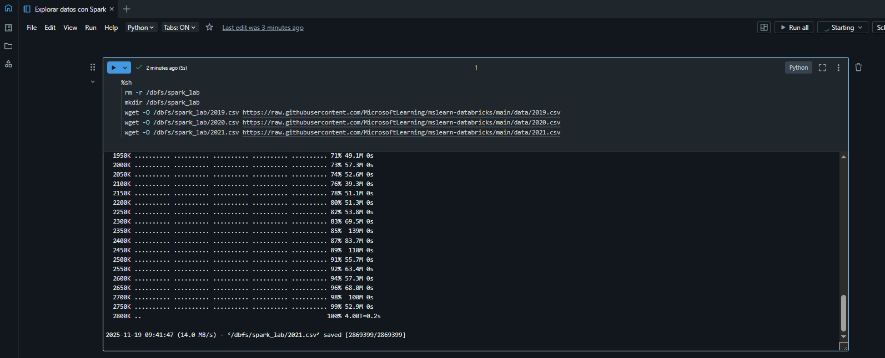

1.  Usa la opción de menú **▸ Run Cell** a la izquierda de la celda para
    ejecutarlo. Luego espera a que el trabajo de Spark ejecutado por el
    código se complete.

Datos de consulta en archivos

1.  Mueve el ratón bajo la celda de código existente y utiliza el icono
    de **+** **Code** que aparece para añadir una nueva celda de código.
    Luego, en la nueva celda, introduce y ejecuta el siguiente código
    para cargar los datos de los archivos y ver las primeras 100 filas.

> df = spark.read.load('spark\_lab/\*.csv', format='csv')
>
> display(df.limit(100))
>
> 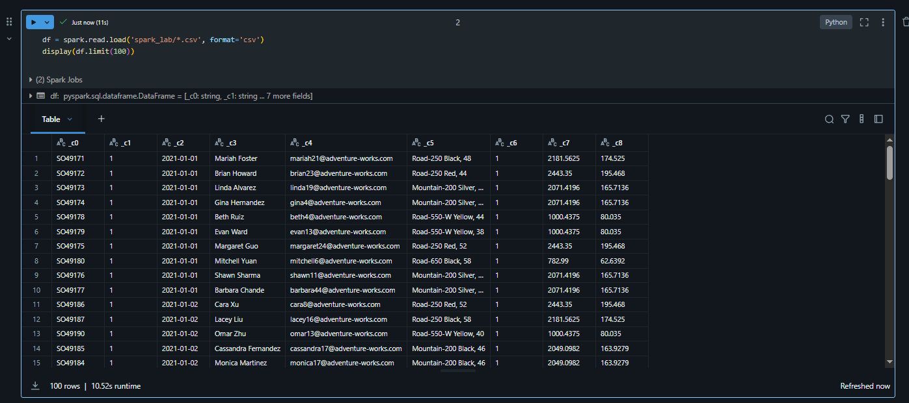 style="width:6.1375in;height:2.72847in" />

1.  Consulta la salida y ten en cuenta que los datos del archivo están
    relacionados con órdenes de venta, pero no incluyen los encabezados
    de columna ni información sobre los tipos de datos. Para entender
    mejor los datos, puedes definir un *esquema* para el dataframe.

2.  Añade una nueva celda de código y úsala para ejecutar el siguiente
    código, que define un esquema para los datos:

> from pyspark.sql.types import \*
>
> from pyspark.sql.functions import \*
>
> orderSchema = StructType(\[
>
> StructField("SalesOrderNumber", StringType()),
>
> StructField("SalesOrderLineNumber", IntegerType()),
>
> StructField("OrderDate", DateType()),
>
> StructField("CustomerName", StringType()),
>
> StructField("Email", StringType()),
>
> StructField("Item", StringType()),
>
> StructField("Quantity", IntegerType()),
>
> StructField("UnitPrice", FloatType()),
>
> StructField("Tax", FloatType())
>
> \])
>
> df = spark.read.load('/spark\_lab/\*.csv', format='csv',
> schema=orderSchema)
>
> display(df.limit(100))
>
> 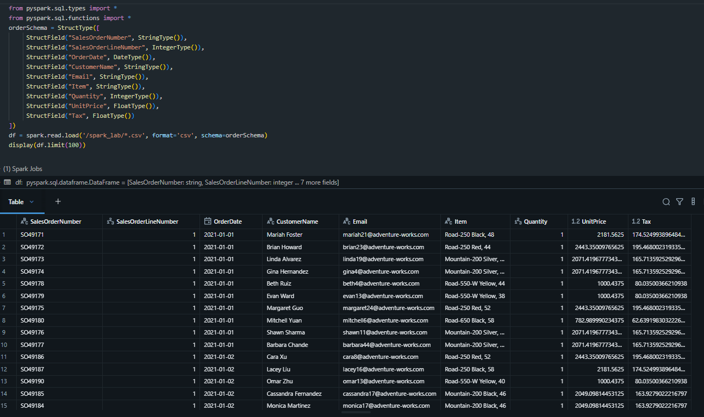 style="width:6.1375in;height:3.63958in" />

1.  Observa que esta vez, el dataframe incluye encabezados de columna.
    Luego añade una nueva celda de código y úsala para ejecutar el
    siguiente código que muestre los detalles del esquema del dataframe
    y verifique que se hayan aplicado los tipos de datos correctos:

> df.printSchema()
>
> 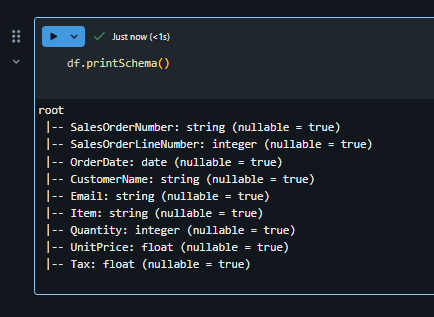 style="width:4.52146in;height:3.30254in" />

Consulta de datos usando Spark SQL

1.  Añade una nueva celda de código y úsala para ejecutar el siguiente
    código:

> df.createOrReplaceTempView("salesorders")
>
> spark\_df = spark.sql("SELECT \* FROM salesorders")
>
> display(spark\_df)
>
> 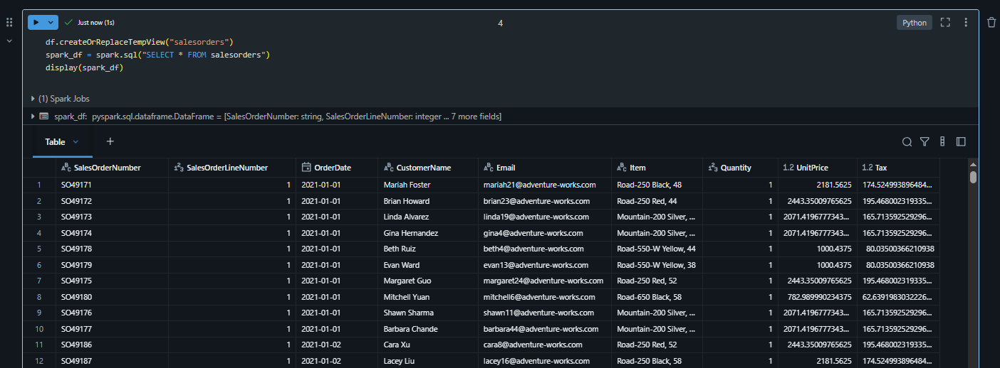 style="width:6.1375in;height:2.26458in" />

Los métodos nativos del objeto dataframe que usaste antes te permiten
consultar y analizar datos de forma bastante efectiva. Sin embargo,
muchos analistas de datos se sienten más cómodos trabajando con la
sintaxis SQL. Spark SQL es una API de lenguaje SQL en Spark que puedes
usar para ejecutar sentencias SQL o incluso para persistir datos en
tablas relacionales.

El código que acabas de ejecutar crea una vista relacional de los datos
en un dataframe y luego usa la biblioteca **spark.sql** para incrustar
la sintaxis SQL de Spark en tu código Python, consultar la vista y
devolver los resultados como dataframe.

Ver los resultados como una visualización

1.  En una nueva celda de código, ejecuta el siguiente código para
    consultar la **tabla de ventas** de pedidos:

> %sql
>
> SELECT \* FROM salesorders
>
> 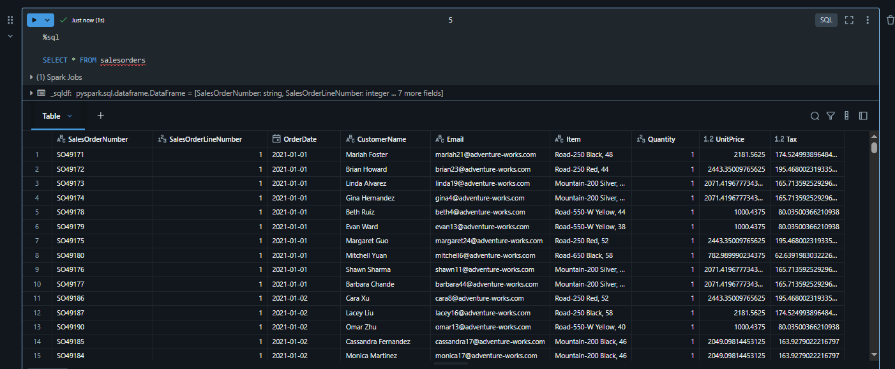 style="width:6.1375in;height:2.53056in" />

1.  Sobre la tabla de resultados, selecciona **+** y luego selecciona
    **Visualization** para ver el editor de visualización, y después
    aplica las siguientes opciones:

    -   **Visualization type**: Bar

    -   **X Column**: Ítem

    -   **Y Columna**: *Añade una nueva columna y selecciona*
        **Quantity**. Aplica la agregación de **Sum**.

2.  Guarda la visualización y luego vuelve a ejecutar la celda de código
    para ver el gráfico resultante en el cuaderno.

> 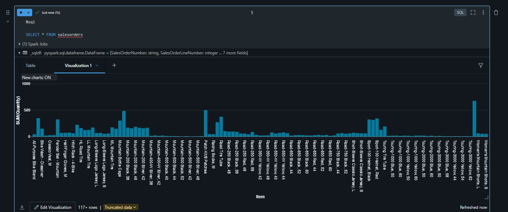 style="width:6.1375in;height:2.57014in" />

Iniciando con matplotlib

1.  En una nueva celda de código, ejecuta el siguiente código para
    recuperar algunos datos de pedidos de venta en un dataframe:

> sqlQuery = "SELECT CAST(YEAR(OrderDate) AS CHAR(4)) AS OrderYear, \\
>
> SUM((UnitPrice \* Quantity) + Tax) AS GrossRevenue \\
>
> FROM salesorders \\
>
> GROUP BY CAST(YEAR(OrderDate) AS CHAR(4)) \\
>
> ORDER BY OrderYear"
>
> df\_spark = spark.sql(sqlQuery)
>
> df\_spark.show()
>
> 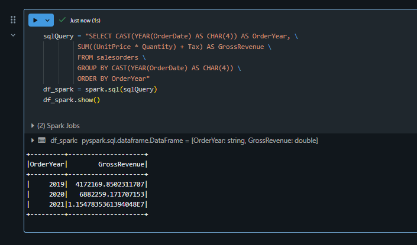 style="width:6.1375in;height:3.6125in" />

1.  Añade una nueva celda de código y úsala para ejecutar el siguiente
    código, que importa la **matplotlib** y la utiliza para crear un
    gráfico:

> from matplotlib import pyplot as plt
>
> \# matplotlib requires a Pandas dataframe, not a Spark one
>
> df\_sales = df\_spark.toPandas()
>
> \# Create a bar plot of revenue by year
>
> plt.bar(x=df\_sales\['OrderYear'\],
> height=df\_sales\['GrossRevenue'\])
>
> \# Display the plot
>
> plt.show()

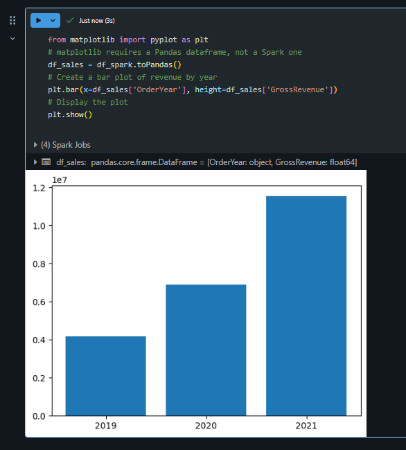

1.  Revisa los resultados, que consisten en un cuadro de columnas con el
    ingreso bruto total de cada año. Observa las siguientes
    características del código utilizado para producir este gráfico:

    -   La biblioteca **matplotlib** requiere un dataframe Pandas, así
        que necesitas convertir el dataframe de Spark devuelto por la
        consulta SQL de Spark a este formato.

    -   En el núcleo de la biblioteca **matplotlib** está el objeto
        **pyplot**. Esta es la base de la mayoría de las funcionalidades
        de trazado.

2.  La configuración predeterminada da como resultado un gráfico
    utilizable, pero hay bastante margen para personalizarlo. Añade una
    nueva celda de código con el siguiente código y ejecuta:

> \# Clear the plot area
>
> plt.clf()
>
> \# Create a bar plot of revenue by year
>
> plt.bar(x=df\_sales\['OrderYear'\],
> height=df\_sales\['GrossRevenue'\], color='orange')
>
> \# Customize the chart
>
> plt.title('Revenue by Year')
>
> plt.xlabel('Year')
>
> plt.ylabel('Revenue')
>
> plt.grid(color='#95a5a6', linestyle='--', linewidth=2, axis='y',
> alpha=0.7)
>
> plt.xticks(rotation=45)
>
> \# Show the figure
>
> plt.show()

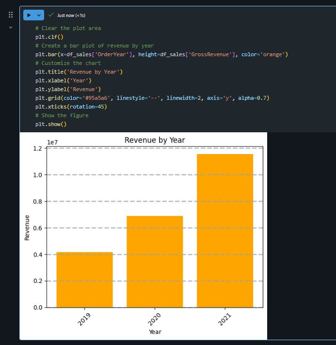

1.  Técnicamente, una trama (plot) está contenida con una **Figure**. En
    los ejemplos anteriores, la figura fue creada implícitamente para
    ti; Pero puedes crearlo explícitamente. Prueba a ejecutar lo
    siguiente en una celda nueva:

> \# Clear the plot area
>
> plt.clf()
>
> \# Create a Figure
>
> fig = plt.figure(figsize=(8,3))
>
> \# Create a bar plot of revenue by year
>
> plt.bar(x=df\_sales\['OrderYear'\],
> height=df\_sales\['GrossRevenue'\], color='orange')
>
> \# Customize the chart
>
> plt.title('Revenue by Year')
>
> plt.xlabel('Year')
>
> plt.ylabel('Revenue')
>
> plt.grid(color='#95a5a6', linestyle='--', linewidth=2, axis='y',
> alpha=0.7)
>
> plt.xticks(rotation=45)
>
> \# Show the figure
>
> plt.show()
>
> 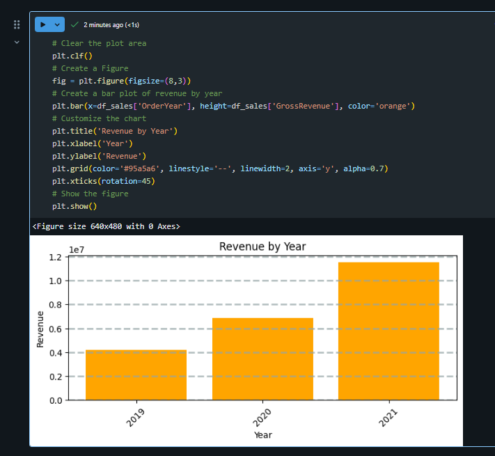 style="width:4.63725in;height:4.27206in" />

1.  Una figura puede contener múltiples subplots, cada una en su propio
    eje. Utiliza este código para crear múltiples gráficos:

> \# Clear the plot area
>
> plt.clf()
>
> \# Create a figure for 2 subplots (1 row, 2 columns)
>
> fig, ax = plt.subplots(1, 2, figsize = (10,4))
>
> \# Create a bar plot of revenue by year on the first axis
>
> ax\[0\].bar(x=df\_sales\['OrderYear'\],
> height=df\_sales\['GrossRevenue'\], color='orange')
>
> ax\[0\].set\_title('Revenue by Year')
>
> \# Create a pie chart of yearly order counts on the second axis
>
> yearly\_counts = df\_sales\['OrderYear'\].value\_counts()
>
> ax\[1\].pie(yearly\_counts)
>
> ax\[1\].set\_title('Orders per Year')
>
> ax\[1\].legend(yearly\_counts.keys().tolist())
>
> \# Add a title to the Figure
>
> fig.suptitle('Sales Data')
>
> \# Show the figure
>
> plt.show()
>
> 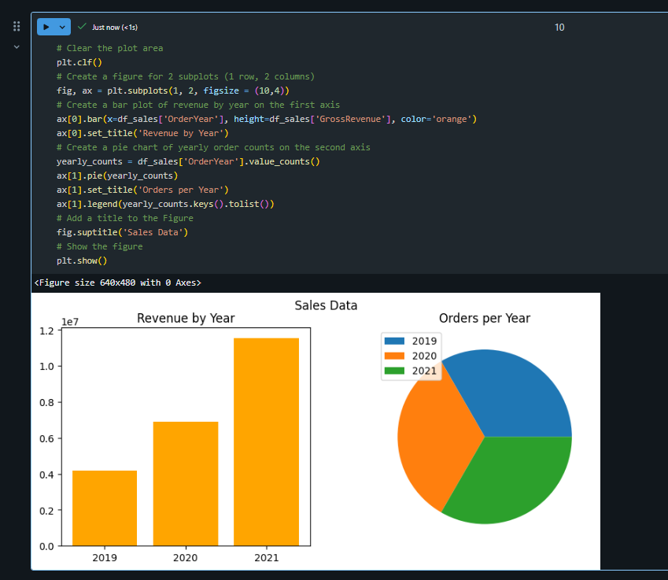 style="width:4.71124in;height:4.08969in" />

**Nota:** Para saber más sobre el trazado con matplotlib, consulta la
[documentación de matplotlib](https://matplotlib.org/).

Usa la biblioteca Seaborn

1.  Añade una nueva celda de código y úsala para ejecutar el siguiente
    código, que utiliza la biblioteca seaborn (que está construida sobre
    matplotlib y abstrae parte de su complejidad) para crear un gráfico:

> import seaborn as sns
>
> \# Clear the plot area
>
> plt.clf()
>
> \# Create a bar chart
>
> ax = sns.barplot(x="OrderYear", y="GrossRevenue", data=df\_sales)
>
> plt.show()
>
> 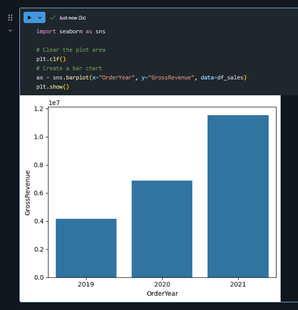 style="width:4.19545in;height:4.35377in" />

1.  La biblioteca **seaborn** facilita la creación de gráficos complejos
    de datos estadísticos y te permite controlar el tema visual para
    visualizaciones de datos consistentes. Ejecuta el siguiente código
    en una nueva celda:

2.  

> \# Clear the plot area
>
> plt.clf()
>
> \# Set the visual theme for seaborn
>
> sns.set\_theme(style="whitegrid")
>
> \# Create a bar chart
>
> ax = sns.barplot(x="OrderYear", y="GrossRevenue", data=df\_sales)
>
> plt.show()
>
> 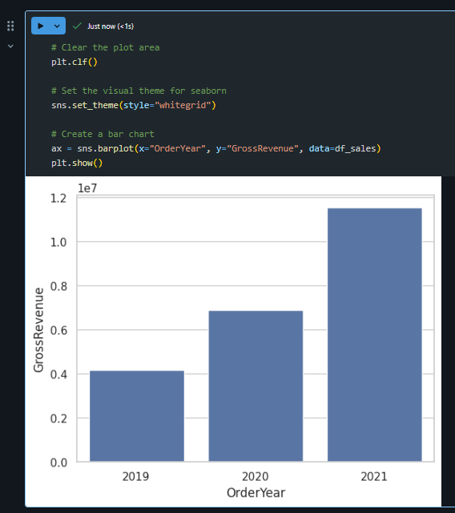 style="width:3.54479in;height:3.99414in" />

1.  Como matplotlib. Seaborn admite múltiples tipos de cartas. Ejecuta
    el siguiente código para crear un gráfico de líneas:

2.  

> \# Clear the plot area
>
> plt.clf()
>
> \# Create a bar chart
>
> ax = sns.lineplot(x="OrderYear", y="GrossRevenue", data=df\_sales)
>
> plt.show()
>
> 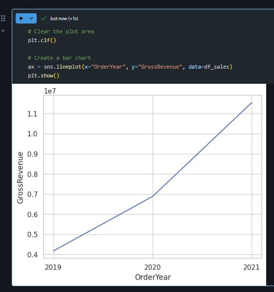 style="width:4.12994in;height:4.39543in" />

**Nota:** Para saber más sobre cómo trazar con seaborn, consulta la
[documentación de seaborn](https://seaborn.pydata.org/index.html).

Cerrar la ejecución del serrvidor
