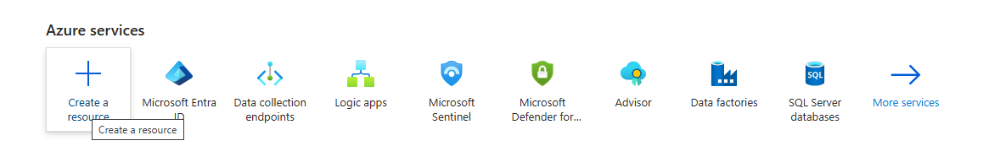
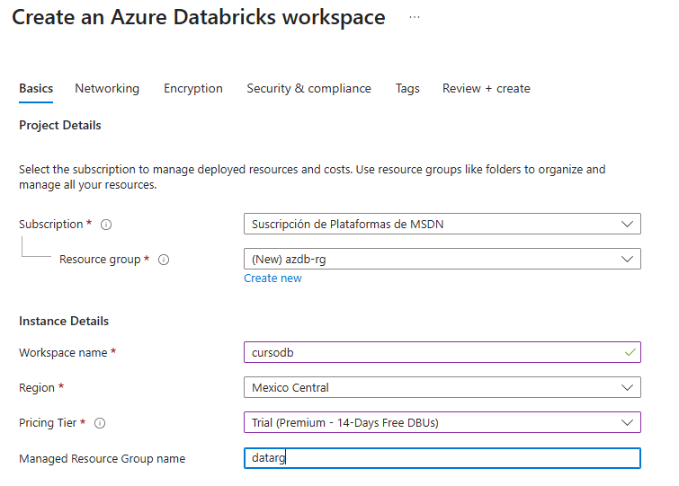
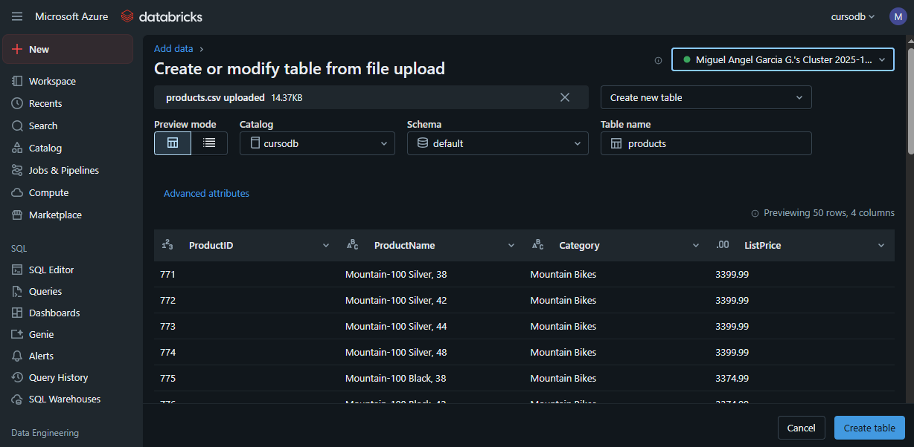
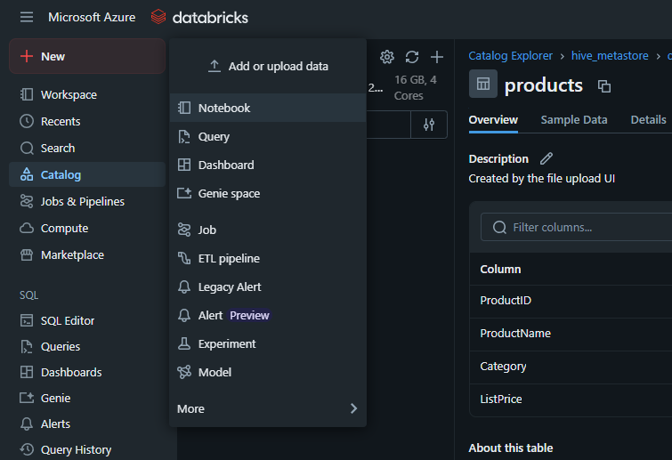
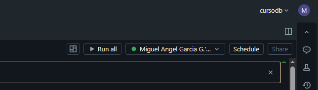
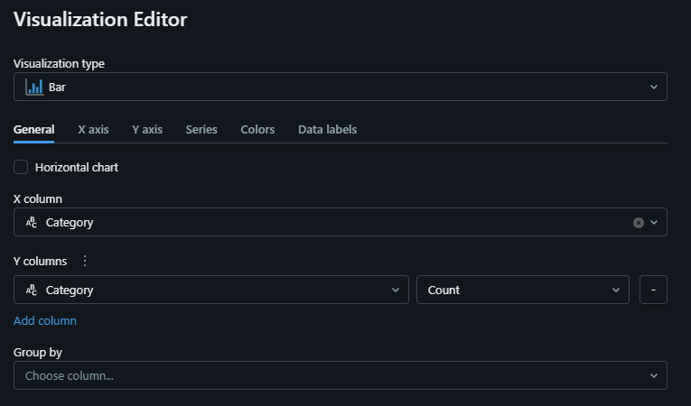
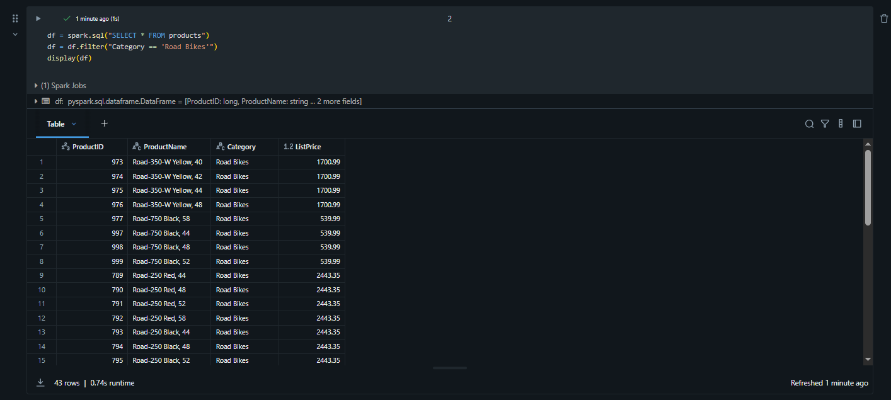
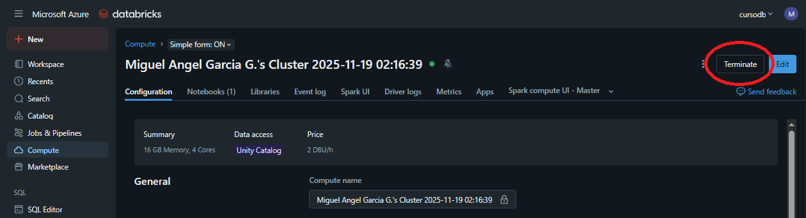

Azure Databricks es una versión basada en Microsoft Azure de la popular
plataforma de código abierto Databricks.

Un espacio de trabajo *de Azure Databricks* proporciona un punto central
para gestionar clústeres, datos y recursos de Databricks en Azure.

En este ejercicio, provisionarás un espacio de trabajo Azure Databricks
y explorarás algunas de sus capacidades principales.

Provisión del espacio de trabajo de Azure Databricks

1.  Inicia sesión en el **portal de Azure** en https://portal.azure.com.

2.  En el portal, seleccionar Crear recurso y seleccionar Dtabricks

> 3.- Seleccionar **Create**
>
>  style="width:6.1375in;height:2.06736in" />

4.- Llenar los datos para crear el grupo de recursos de Azure Databricks
con los datos propios.

5.- Esperar cerca de 10 minutos a que termine de crearse.

Crear un clúster

Azure Databricks es una plataforma de procesamiento distribuida que
utiliza clústeres Apache Spark para procesar datos en paralelo en
múltiples nodos.

Cada clúster consta de un nodo ***controller*** para coordinar el
trabajo y nodos ***workers*** para realizar tareas de procesamiento. En
este ejercicio, crearás un *clúster de un solo nodo* para minimizar los
recursos de cómputo utilizados en el entorno de laboratorio (en el que
los recursos pueden estar limitados). En un entorno de producción,
normalmente crearías un clúster con varios nodos de trabajo.

1.  En el portal de Azure, navega por el grupo de recursos que contiene
    tu espacio de trabajo existente en Azure Databricks y selecciona tu
    recurso de Servicio Azure Databricks.

2.  En la página de Resumen de tu espacio de trabajo, utiliza el botón
    **Launch Workspace** para abrir tu espacio de trabajo Azure
    Databricks en una nueva pestaña del navegador; inicia sesión si se
    lo solicita.

Al utilizar el portal Databricks Workspace, pueden mostrarse diversos
consejos y notificaciones. Cerrar estos y sigue las instrucciones
proporcionadas para completar las tareas de este ejercicio.

1.  En la barra lateral de la izquierda, selecciona **(+)** New y luego
    selecciona **Clúster** (puede que tengas que buscar en el submenú
    **More**)

2.  

3.  En la página de **New Cluster**, crea un nuevo clúster con los
    siguientes ajustes:

    -   **Computer Name**: *Clúster de nombre de usuario* (el nombre
        predeterminado del clúster)

    -   **Policy**: Sin restricciones

    -   **Modo de clúster**: Single node.

    -   **Access mode**: Dedicated (formely: Single user) (*con tu
        cuenta de usuario seleccionada*)

    -   **Databricks runtime**: 17.3 LTS (Spark 4.0, Scala 2.13) o
        posterior

    -   **Photon acceleration**: seleccionado

    -   **Tipo de nodo**: Standard\_D4ds\_v5

    -   **Terminate after** *20* **minutes of inactivity**

    -   Seleccionar **Create**

4.  Espera a que se cree el clúster. Puede que tarde uno o dos minutos.

Utiliza Spark para analizar datos

Como en muchos entornos Spark, Databricks permite el uso de cuadernos
para combinar notas y celdas de código interactivas que puedes usar para
explorar datos.

-   Descarga el archivo products.csv de
    https://raw.githubusercontent.com/MicrosoftLearning/mslearn-databricks/main/data/products.csv
    a tu computadora local, guardándolo como **products.csv**.

-   En la barra lateral, en el menú **(+) New** enlace, selecciona **Add
    or upload data**.

-   Selecciona **Create or modify table** y sube el archivo
    **products.csv** que descargaste a tu computadora.

-   En la página **Create or modify from file upload**, asegúrate de que
    tu clúster esté seleccionado en la parte superior derecha de la
    página. Luego elige el **Catalog** de **hive\_metastore** y su
    esquema predeterminado para crear una nueva tabla llamada
    **products**.

-   En la página del **Catalog** **Explorer**, cuando se haya creado la
    tabla de productos, en el menú del botón **Create**, selecciona
    **Notebook** para crear un cuaderno.

-   En el cuaderno, asegúrate de que esté conectado a tu clúster

>  style="width:6.1375in;height:1.75347in" />
>
> %sql
>
> SELECT \* FROM hive\_metastore.default.products;

-   Usa la opción de menú **▸ Run Cell** a la izquierda de la celda para
    ejecutarlo, iniciando y conectando el clúster si se le pide.

-   Espera a que el trabajo de Spark ejecutado por el código se
    complete. El código recupera datos de la tabla que se creó en base
    al archivo que subiste.

-   Encima de la tabla de resultados, selecciona **+** y luego
    selecciona **Visualization** para ver el editor de visualización, y
    después aplica las siguientes opciones:

    -   **Visualization type**: Bar

    -   **X Column**: Category

    -   **Y Column**: *Añade una nueva columna y selecciona*
        **ProductID.** Aplica la agregación de **Count**.

-   

Guarda la visualización y observa que se muestra en el cuaderno, así:

Analizar datos con un dataframe

Aunque la mayoría de los analistas de datos se sienten cómodos usando
código SQL como en el ejemplo anterior, algunos analistas y científicos
de datos pueden emplear objetos nativos de Spark, como un *dataframe*,
en lenguajes de programación como *PySpark* (una versión optimizada para
Spark de Python) para trabajar eficientemente con datos.

1.  En el cuaderno, bajo la gráfica que se produce desde la celda de
    código ejecutada anteriormente, usa el icono de **+** **Code** para
    añadir una nueva celda.

> Puede que tengas que mover el ratón bajo la celda de salida para que
> aparezca el **icono del Código +**.

1.  Introduce y ejecuta el siguiente código en la nueva celda:

> df = spark.sql("SELECT \* FROM products")
>
> df = df.filter("Category == 'Road Bikes'")
>
> display(df)

1.  Ejecuta la nueva célula, que devuelve productos de la categoría *de
    Road Bikes*.

Detener la ejecución del clúster.

