Delta Lake es un proyecto de código abierto para construir una capa de
almacenamiento de datos transaccional para Spark sobre un lago de datos.
Delta Lake añade soporte para semántica relacional tanto para
operaciones por lotes como para operaciones de datos en streaming, y
permite la creación de una arquitectura *Lakehouse* en la que Apache
Spark puede usarse para procesar y consultar datos en tablas basadas en
archivos subyacentes del lago de datos.

Conectar al workspace creado previamente

1.  Iniciar sesión en Azure.

2.  Entrar al servicio de Azure Databricks creado previamente

3.  Seleccionar **Launch Workspace**

Crear un notebook

1.  En la barra lateral, usa el enlace **New** **(+)**para crear un
    **Notebook**.

2.  Cambia el nombre predeterminado del cuaderno (Cuaderno sin título
    *\[fecha\]*) a **Explorar Delta Lake** y, en la lista desplegable
    **Connect**, selecciona tu grupo si aún no está seleccionado. Si el
    clúster no funciona, puede tardar un minuto o así en arrancar.

3.  En la primera celda del cuaderno, introduce el siguiente código, que
    utiliza comandos de shell para descargar archivos de datos desde
    GitHub al sistema de archivos que utiliza tu clúster.

%sh

rm -r /dbfs/delta\_lab

mkdir /dbfs/delta\_lab

wget -O /dbfs/delta\_lab/products.csv
<https://raw.githubusercontent.com/MicrosoftLearning/mslearn-databrics/main/data/products.csv>

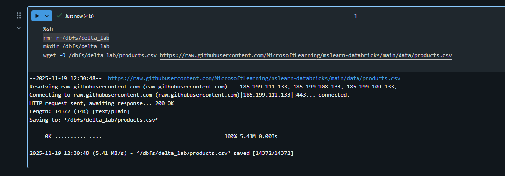

1.  Usa la opción de menú **Run Cell▸** a la izquierda de la celda para
    ejecutarlo. Luego espera a que el trabajo de Spark ejecutado por el
    código se complete.

2.  Bajo la celda de código existente, utiliza el icono **+** **Code**
    para añadir una nueva celda de código. Luego, en la nueva celda,
    introduce y ejecuta el siguiente código para cargar los datos del
    archivo y ver las primeras 10 filas.

> df = spark.read.load('/delta\_lab/products.csv', format='csv',
> header=True)
>
> display(df.limit(10))
>
> 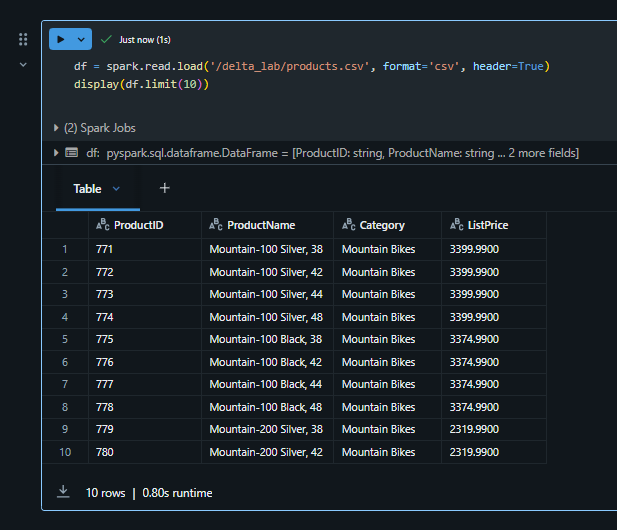 style="width:5.27292in;height:4.52953in" />

Carga los datos del archivo en una tabla delta

Los datos se han cargado en un dataframe. Vamos a persistir en una tabla
delta.

1.  Añade una nueva celda de código y úsala para ejecutar el siguiente
    código:

delta\_table\_path = "/delta/products-delta"

df.write.format("delta").save(delta\_table\_path)

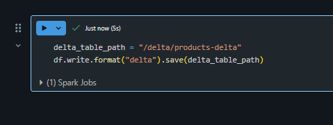

Los datos de una tabla delta lake se almacenan en formato Parquet.
También se crea un archivo de registro para registrar las modificaciones
realizadas en los datos.

1.  Añade una nueva celda de código y úsala para ejecutar el siguiente
    comando shell y así ver el contenido de la carpeta donde se han
    guardado los datos delta.

> %sh
>
> ls /dbfs/delta/products-delta
>
> 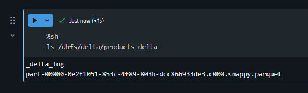 style="width:5.407in;height:1.63565in" />

1.  Los datos del archivo en formato Delta pueden cargarse en un objeto
    **DeltaTable**, que puedes usar para ver y actualizar los datos de
    la tabla. Ejecuta el siguiente código en una nueva celda para
    actualizar los datos; reduciendo el precio del producto 771 en un
    10%.

> from delta.tables import \*
>
> from pyspark.sql.functions import \*
>
> \# Create a deltaTable object
>
> deltaTable = DeltaTable.forPath(spark, delta\_table\_path)
>
> \# Update the table (reduce price of product 771 by 10%)
>
> deltaTable.update(
>
> condition = "ProductID == 771",
>
> set = { "ListPrice": "ListPrice \* 0.9" })
>
> \# View the updated data as a dataframe
>
> deltaTable.toDF().show(10)

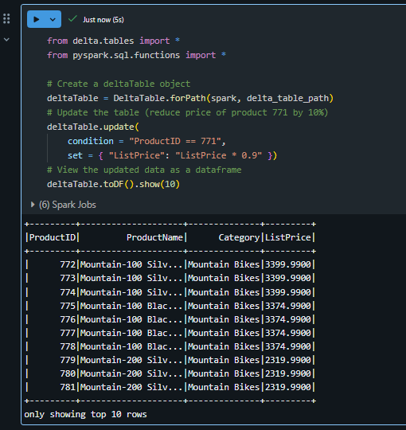

La actualización se mantiene en los datos de la carpeta delta y se
refleja en cualquier nuevo dataframe cargado desde esa ubicación.

1.  Ejecuta el siguiente código para crear un nuevo dataframe a partir
    de los datos de la tabla delta:

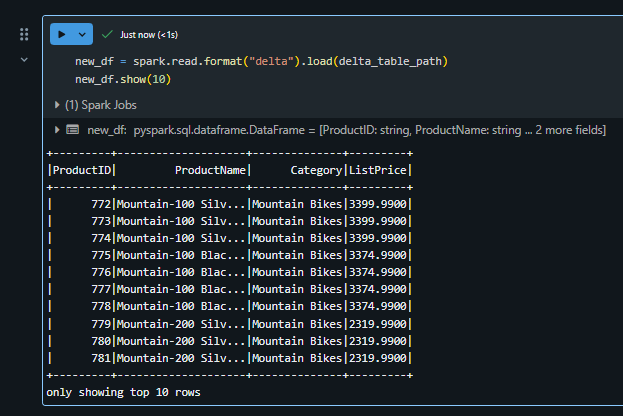

Explora logs y los viajes en el tiempo

Las modificaciones de datos se registran, lo que te permite utilizar las
*capacidades de viaje en el tiempo* de Delta Lake para ver versiones
anteriores de los datos.

1.  En una nueva celda de código, utiliza el siguiente código para ver
    la versión original de los datos del producto:

> new\_df = spark.read.format("delta").option("versionAsOf",
> 0).load(delta\_table\_path)
>
> new\_df.show(10)
>
> 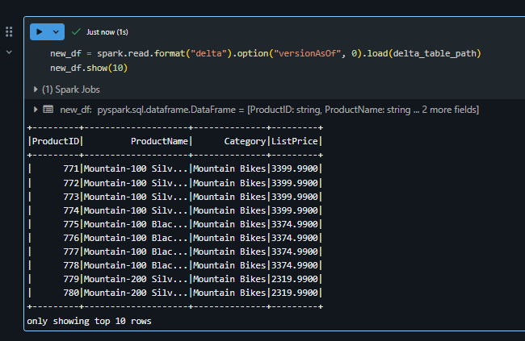 style="width:5.0198in;height:3.26645in" />

1.  El registro contiene un historial completo de modificaciones a los
    datos. Utiliza el siguiente código para ver un registro de los
    últimos 10 cambios:

> deltaTable.history(10).show(10, False, True)
>
>  style="width:6.1375in;height:1.99583in" />

Crear tablas de catálogo

Hasta ahora has trabajado con tablas delta cargando datos desde la
carpeta que contiene los archivos de parquet en los que se basa la
tabla. Puedes definir *tablas de catálogo* que encapsulen los datos y
proporcionen una entidad de tabla con nombre que puedas consultar en
código SQL. Spark admite dos tipos de tablas de catálogo para Delta
Lake:

-   ***External tables*** que se definen por la ruta hacia los archivos
    que contienen los datos de la tabla.

-   ***Managed tables***, que se definen en la metastore.

Crea una tabla externa

1.  Utiliza el siguiente código para crear una nueva base de datos
    llamada **AdventureWorks** y luego crea una tabla externa llamada
    **ProductsExternal** en esa base de datos basada en la ruta hacia
    los archivos Delta que definiste anteriormente:

> spark.sql("CREATE DATABASE AdventureWorks")
>
> spark.sql("CREATE TABLE AdventureWorks.ProductsExternal USING DELTA
> LOCATION '{0}'".format(delta\_table\_path))
>
> spark.sql("DESCRIBE EXTENDED
> AdventureWorks.ProductsExternal").show(truncate=False)
>
> 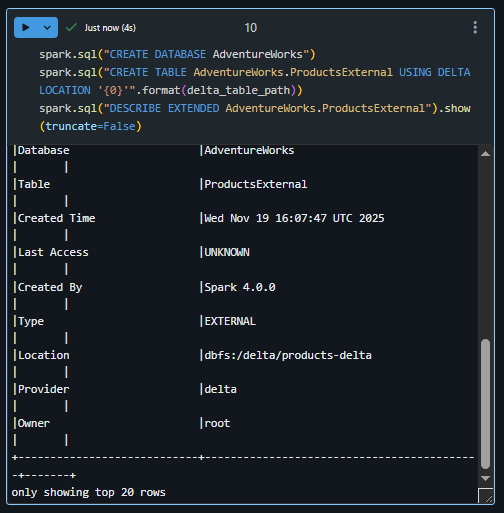 style="width:5.25073in;height:5.3445in" />
>
> Considera la propiedad **Location** de la nueva tabla es la ruta que
> has especificado.

1.  Utiliza el siguiente código para consultar la tabla:

> %sql
>
> USE AdventureWorks;
>
> SELECT \* FROM ProductsExternal;

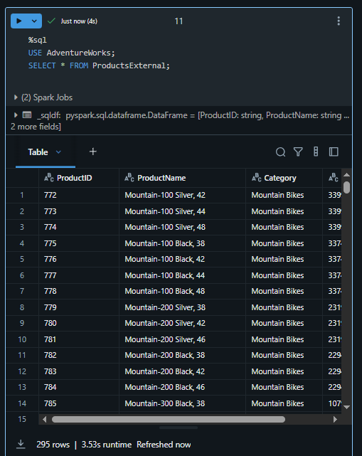

Crear una tabla administrada

1.  Ejecuta el siguiente código para crear (y luego describir) una tabla
    administrada llamada **ProductsManaged** basada en el dataframe que
    cargaste originalmente desde el **archivo products.csv** (antes de
    actualizar el precio del producto 771).

> df.write.format("delta").saveAsTable("AdventureWorks.ProductsManaged")
>
> spark.sql("DESCRIBE EXTENDED
> AdventureWorks.ProductsManaged").show(truncate=False)
>
> 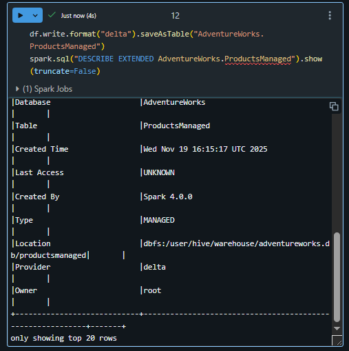 style="width:3.96702in;height:3.98267in" />

No especificaste una ruta para los archivos parquet usados por la tabla;
esto se gestiona para ti en la metatienda Hive y se muestra en la
propiedad **Location** de la descripción de la tabla.

1.  Utiliza el siguiente código para consultar la tabla administrada,
    teniendo en cuenta que la sintaxis es exactamente la misma que para
    una tabla administrada:

> %sql
>
> USE AdventureWorks;
>
> SELECT \* FROM ProductsManaged;

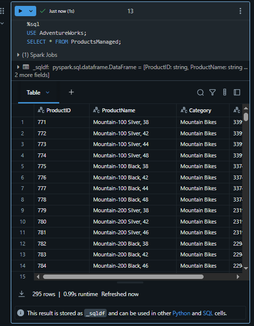

Comparar tablas externas y administradas

1.  Utiliza el siguiente código para listar las tablas en la base de
    datos de AdventureWorks:

> %sql
>
> USE AdventureWorks;
>
> SHOW TABLES;
>
> 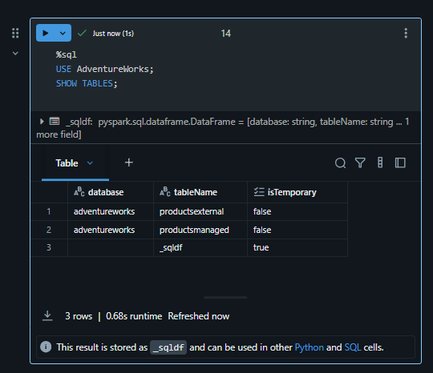 style="width:4.26465in;height:3.68024in" />

1.  Ahora utiliza el siguiente código para ver las carpetas en las que
    se basan estas tablas:

> %sh
>
> echo "External table:"
>
> ls /dbfs/delta/products-delta
>
> echo
>
> echo "Managed table:"
>
> ls /dbfs/user/hive/warehouse/adventureworks.db/productsmanaged
>
> 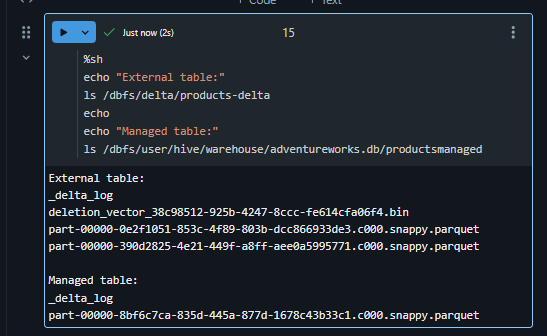 style="width:4.10799in;height:2.52337in" />

1.  Utiliza el siguiente código para eliminar ambas tablas de la base de
    datos:

> %sql
>
> USE AdventureWorks;
>
> DROP TABLE IF EXISTS ProductsExternal;
>
> DROP TABLE IF EXISTS ProductsManaged;
>
> SHOW TABLES;
>
> 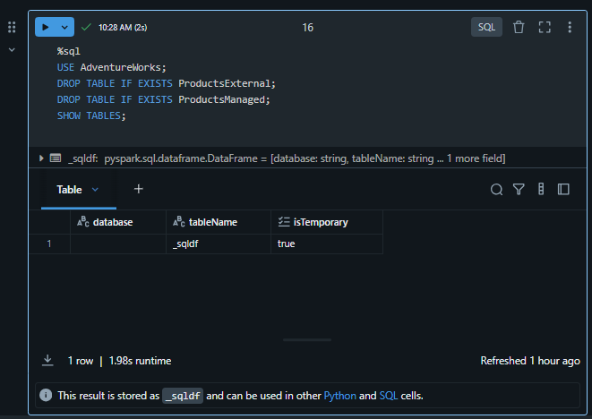 style="width:5.09951in;height:3.61028in" />

1.  Ahora vuelve a ejecutar la celda que contiene el siguiente código
    para ver el contenido de las carpetas delta:

> %sh
>
> echo "External table:"
>
> ls /dbfs/delta/products-delta
>
> echo
>
> echo "Managed table:"
>
> ls /dbfs/user/hive/warehouse/adventureworks.db/productsmanaged
>
> 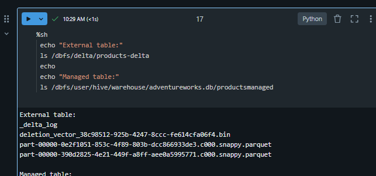 style="width:5.4258in;height:2.53978in" />

Los archivos de la tabla administrada se eliminan automáticamente cuando
la tabla se elimina. Sin embargo, los archivos de la tabla externa
permanecen. Eliminar una tabla externa solo elimina los metadatos de la
tabla de la base de datos; No elimina los archivos de datos.

1.  Utiliza el siguiente código para crear una nueva tabla en la base de
    datos basada en los archivos delta de la **carpeta products-delta**:

> %sql
>
> USE AdventureWorks;
>
> CREATE TABLE Products
>
> USING DELTA
>
> LOCATION '/delta/products-delta';

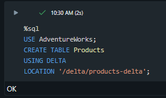

1.  Utiliza el siguiente código para consultar la nueva tabla:

> %sql
>
> USE AdventureWorks;
>
> SELECT \* FROM Products;
>
> 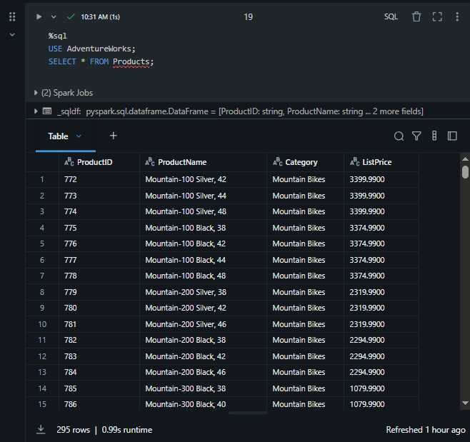 style="width:4.44445in;height:4.18094in" />

Como la tabla se basa en los archivos delta existentes, que incluyen el
historial registrado de cambios, refleja las modificaciones que hiciste
previamente en los datos del producto.

Optimizar la disposición de las tablas

El almacenamiento físico de los datos de la tabla y los datos de índice
asociados puede reorganizarse para reducir el espacio de almacenamiento
y mejorar la eficiencia de E/S al acceder a la tabla. Esto es
especialmente útil tras realizar operaciones sustanciales de inserción,
actualización o eliminación en una tabla.

1.  En una nueva celda de código, utiliza el siguiente código para
    optimizar el diseño y limpiar versiones antiguas de los archivos de
    datos en la tabla delta:

> %sql
>
> USE AdventureWorks;
>
> SELECT \* FROM Products;
>
> 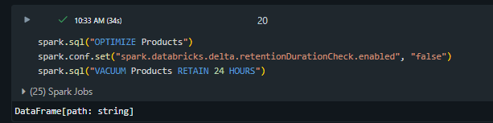 style="width:5.49772in;height:1.37225in" />

Delta Lake tiene una comprobación de seguridad para evitar que ejecutes
un comando peligroso de ASPIRACIÓN. En Databricks Runtime, si estás
seguro de que no se están realizando operaciones en esta tabla que duren
más tiempo que el intervalo de retención que planeas especificar, puedes
desactivar esta comprobación de seguridad configurando la propiedad de
configuración de Spark
spark.databricks.delta.retentionDurationCheck.enabled en false.

**Nota:** Si ejecutas VACUUM en una tabla delta, pierdes la capacidad de
viajar en el tiempo a una versión anterior al periodo de retención de
datos especificado.

Ya puedes cerrar tu servidor.
