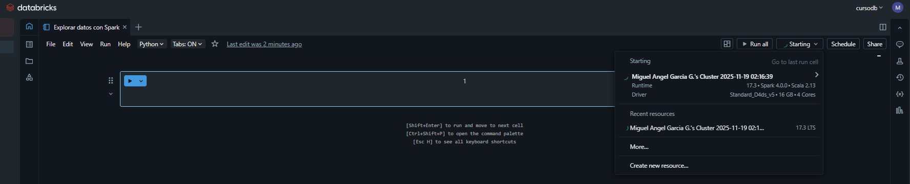
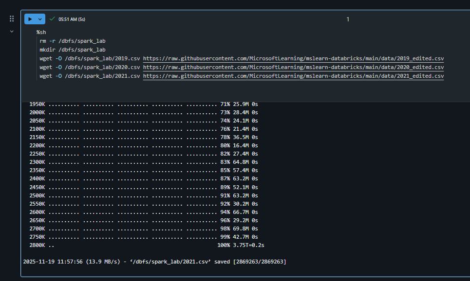
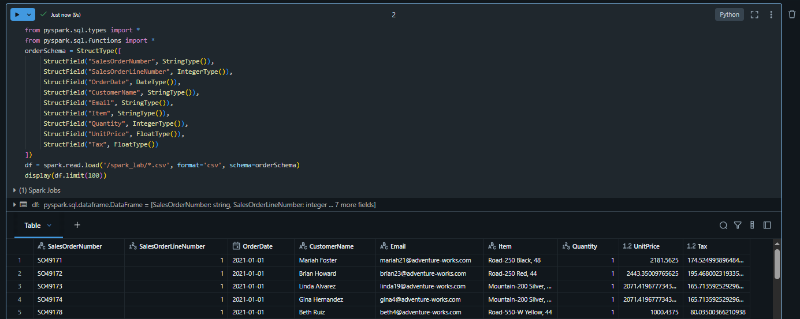
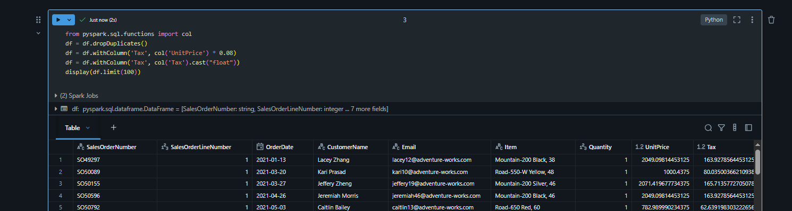
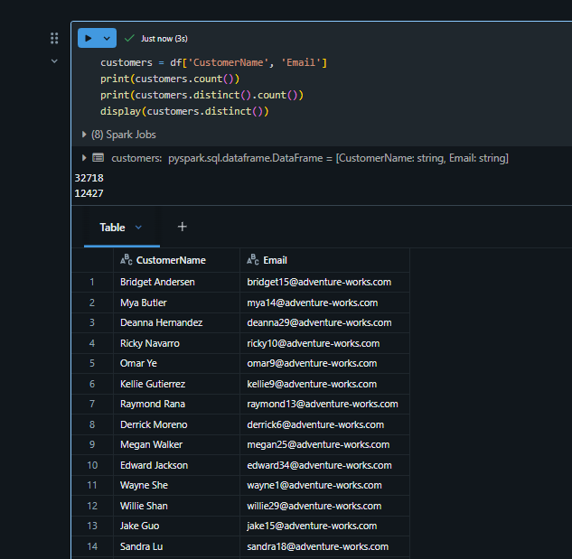
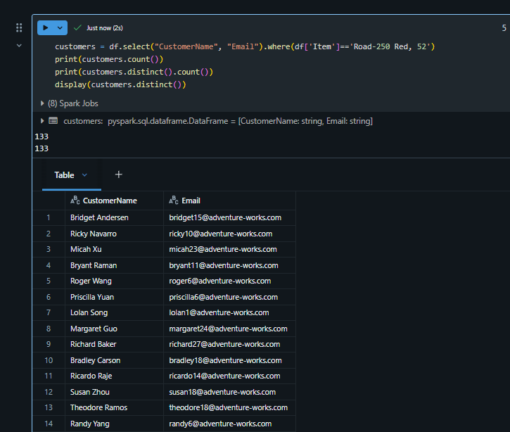
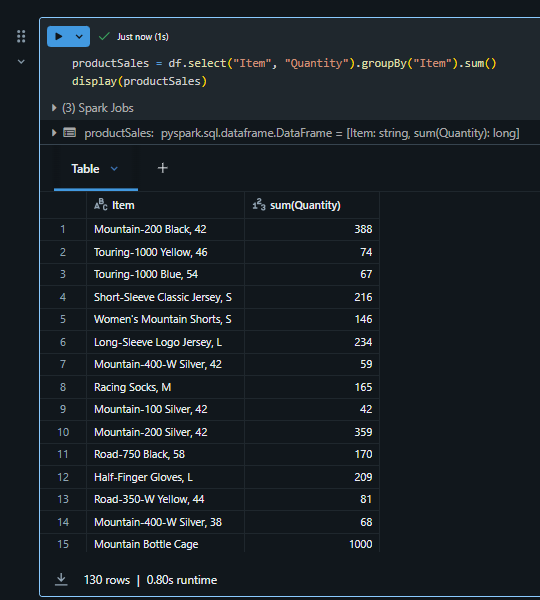
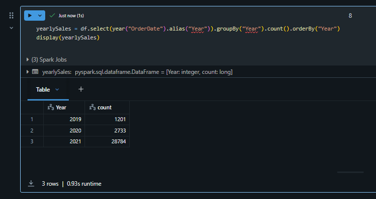
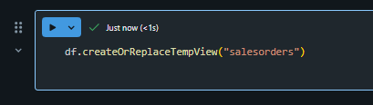
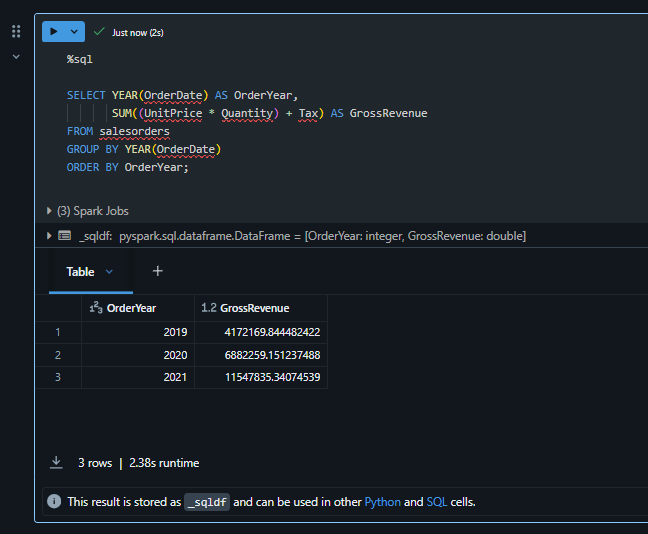

Las tareas comunes de transformación de datos en Azure Databricks
incluyen limpieza de datos, realización de agregaciones y casting de
tipos. Estas transformaciones son esenciales para preparar datos para el
análisis y forman parte del proceso más amplio ETL (Extract, Transform,
Load).

Conectar al workspace creado previamente

1.  Iniciar sesión en Azure.

2.  Entrar al servicio de Azure Databricks creado previamente

3.  Seleccionar **Launch Workspace**

Crear un notebook

1.  En la barra lateral, usa el enlace **New** **(+)**para crear un
    **Notebook**.

2.  Cambia el nombre predeterminado del cuaderno (Cuaderno sin título
    *\[fecha\]*) a **Transformar** **datos con Spark** y, en la lista
    desplegable **Connect**, selecciona tu grupo si aún no está
    seleccionado. Si el clúster no funciona, puede tardar un minuto o
    así en arrancar.

Datos de ingesta Transformar datos con Spark

1.  En la primera celda del cuaderno, introduce el siguiente código, que
    utiliza comandos de shell para descargar archivos de datos desde
    GitHub al sistema de archivos que utiliza tu clúster.

%sh

rm -r /dbfs/spark\_lab

mkdir /dbfs/spark\_lab

wget -O /dbfs/spark\_lab/2019.csv
https://raw.githubusercontent.com/MicrosoftLearning/mslearn-databricks/main/data/2019\_edited.csv

wget -O /dbfs/spark\_lab/2020.csv
https://raw.githubusercontent.com/MicrosoftLearning/mslearn-databricks/main/data/2020\_edited.csv

wget -O /dbfs/spark\_lab/2021.csv
https://raw.githubusercontent.com/MicrosoftLearning/mslearn-databricks/main/data/2021\_edited.csv

1.  Usa la opción de menú **▸ Run Cell** a la izquierda de la celda para
    ejecutarlo. Luego espera a que el trabajo de Spark ejecutado por el
    código se complete.

1.  Bajo la salida, utiliza el icono **Code** **+** para añadir una
    nueva celda de código y úsalo para ejecutar el siguiente código, que
    define un esquema para los datos:

from pyspark.sql.types import \*

from pyspark.sql.functions import \*

orderSchema = StructType(\[

StructField("SalesOrderNumber", StringType()),

StructField("SalesOrderLineNumber", IntegerType()),

StructField("OrderDate", DateType()),

StructField("CustomerName", StringType()),

StructField("Email", StringType()),

StructField("Item", StringType()),

StructField("Quantity", IntegerType()),

StructField("UnitPrice", FloatType()),

StructField("Tax", FloatType())

\])

df = spark.read.load('/spark\_lab/\*.csv', format='csv',
schema=orderSchema)

display(df.limit(100))

Limpiar los datos

Observa que este conjunto de datos tiene algunas filas duplicadas y
valores nulos en la columna de **Impuestos**. Por lo tanto, se requiere
un paso de limpieza antes de realizar cualquier procesamiento y análisis
adicional con los datos.

1.  Añadir una nueva celda de código. Luego, en la nueva celda,
    introduce y ejecuta el siguiente código para eliminar filas
    duplicadas de la tabla y reemplazar las entradas nulas por los
    valores correctos:

from pyspark.sql.functions import col

df = df.dropDuplicates()

df = df.withColumn('Tax', col('UnitPrice') \* 0.08)

df = df.withColumn('Tax', col('Tax').cast("float"))

display(df.limit(100))

Observa que tras actualizar los valores en la columna de **Tax**, su
tipo de dato vuelve a ser **float**. Esto se debe a que su tipo de dato
cambia a duplicarse tras realizar el cálculo. Dado que **double** tiene
un uso de memoria mayor que **float**, es mejor para el rendimiento
hacer cast de la columna de vuelta a **float**.

Filtrar un dataframe

1.  Añade una nueva celda de código y úsala para ejecutar el siguiente
    código, que será:

    -   Filtra las columnas del dataframe de pedidos de venta para
        incluir solo el nombre del cliente y la dirección de correo
        electrónico.

    -   Cuenta el número total de registros de pedidos

    -   Cuenta el número de clientes distintos

    -   Mostrar los clientes distintos

customers = df\['CustomerName', 'Email'\]

print(customers.count())

print(customers.distinct().count())

display(customers.distinct())

Observa los siguientes detalles:

-   Cuando realizas una operación sobre un dataframe, el resultado es un
    nuevo dataframe (en este caso, se crea un nuevo dataframe de cliente
    seleccionando un subconjunto específico de columnas del dataframe
    df)

-   Los dataframes proporcionan funciones como conteo y distinto que
    pueden usarse para resumir y filtrar los datos que contienen.

-   La sintaxis dataframe\['Field1', 'Field2', ...\] es una forma
    abreviada de definir un subconjunto de columna. También puedes usar
    el método select, así que la primera línea del código anterior
    podría escribirse como customers = df. select ("CustomerName",
    "Email")

1.  Ahora apliquemos un filtro para incluir solo a los clientes que han
    realizado un pedido de un producto específico ejecutando el
    siguiente código en una nueva celda de código:

customers = df.select("CustomerName",
"Email").where(df\['Item'\]=='Road-250 Red, 52')

print(customers.count())

print(customers.distinct().count())

display(customers.distinct())

Ten en cuenta que puedes "encadenar" múltiples funciones para que la
salida de una función se convierta en la entrada para la siguiente; en
este caso, el dataframe creado por el método select es el dataframe de
origen para el método where que se usa para aplicar criterios de
filtrado.

Agregar y agrupar datos en un dataframe

1.  Ejecuta el siguiente código en una nueva celda de código para
    agregar y agrupar los datos del orden:

> productSales = df.select("Item", "Quantity").groupBy("Item").sum()
>
> display(productSales)

Nótese que los resultados muestran la suma de las cantidades de orden
agrupadas por producto. El método **groupBy** agrupa las filas por
*Ítem*, y la función agregada de suma se aplica a todas las columnas
numéricas restantes (en este caso, *Quantity*)

1.  En una nueva celda de código, probemos otra agregación:

> yearlySales =
> df.select(year("OrderDate").alias("Year")).groupBy("Year").count().orderBy("Year")
>
> display(yearlySales)

> Esta vez, los resultados muestran el número de pedidos de ventas por
> año. Ten en cuenta que el método select incluye una función **Year**
> de SQL para extraer el componente año del *campo OrderDate*, y luego
> se utiliza un método **alias** para asignar un nombre de columna al
> valor del año extraído. Los datos se agrupan por la columna de Year
> derivada y se calcula el **count** de filas en cada grupo antes de que
> finalmente se utilice el método **orderBy** para ordenar el dataframe
> resultante.

**Nota:** Para saber más sobre cómo trabajar con Dataframes en Azure
Databricks, consulta [Introducción a DataFrames -
Python](https://docs.microsoft.com/azure/databricks/spark/latest/dataframes-datasets/introduction-to-dataframes-python)
en la documentación de Azure Databricks.

Ejecutar código SQL en una celda

1.  Aunque es útil poder incrustar sentencias SQL en una celda que
    contenga código PySpark, los analistas de datos a menudo solo
    quieren trabajar directamente en SQL. Añade una nueva celda de
    código y úsala para ejecutar el siguiente código.

df.createOrReplaceTempView("salesorders")

Esta línea de código creará una vista temporal que luego podrá usarse
directamente con las sentencias SQL.

1.  En una celda nueva, ejecuta el siguiente código:

> %sql
>
> SELECT YEAR(OrderDate) AS OrderYear,
>
> SUM((UnitPrice \* Quantity) + Tax) AS GrossRevenue
>
> FROM salesorders
>
> GROUP BY YEAR(OrderDate)
>
> ORDER BY OrderYear;
>
>  style="width:5.42171in;height:4.46779in" />

-   La línea **%sql** al principio de la celda (llamada magic) indica
    que el entorno de ejecución del lenguaje SQL de Spark debería usarse
    para ejecutar el código en esta celda en lugar de PySpark.

-   El código SQL hace referencia a la vista de **salesorder **que
    creaste anteriormente.

-   La salida de la consulta SQL se muestra automáticamente como
    resultado bajo la celda.

**Nota:** Para más información sobre Spark SQL y los dataframes,
consulte la [documentación de Spark
SQL](https://spark.apache.org/docs/2.2.0/sql-programming-guide.html).

Ya puedes finalizar la ejecución de tu servidor.
